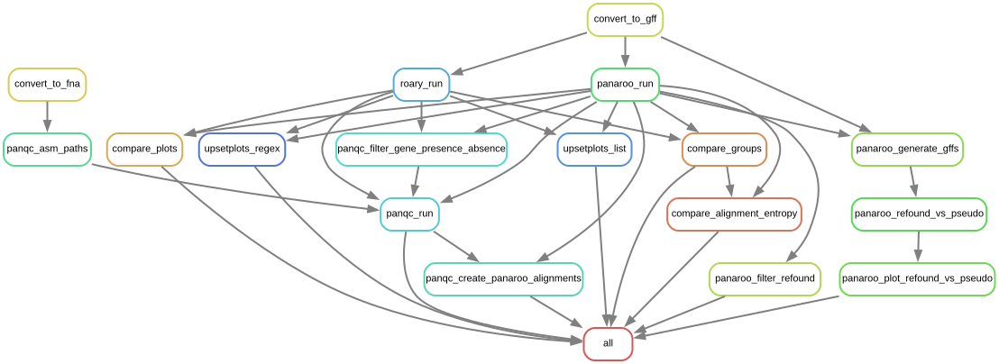

# *M. tuberculosis* pangenome Snakemake pipeline
This Snakemake pipeline determines core and accessory genes among 6 *M. tuberculosis* clinical reference strains from lineages 1 and 2 ([Heiniger et al., 2026](https://doi.org/10.64898/2026.01.27.701740)) with and without the model strain H37Rv included. The pangenome calculated with [Panaroo](https://github.com/gtonkinhill/panaroo), which yields more accurate results for *M. tuberculosis* ([Tonkin-Hill et al., 2020](https://doi.org/10.1186/s13059-020-02090-4)), is compared to the pangenome from the more widely used tool [Roary](https://github.com/sanger-pathogens/Roary) based on the overlap, size and alignment entropy of the predicted orthogroups. Additionally, the quality of the pangenomes is estimated by identifying potentially missed orthogroups using [PanQC](https://github.com/maxgmarin/panqc).

The pangenome is visualized as an [UpSet plot](https://upset.app/) of the orthogroups for all genes and optionally also for selected gene families. These can either be provided as lists of locus tags or as a regular expression (regex) matching the product description. Here, gene identifiers were provided for PE and PPE genes as obtained from the [PE/PPE Snakemake pipeline](https://github.com/mgbteam/mtb_pe_ppe) while a regex was provided for ESX and type II toxin-antitoxin family proteins.

[TOC]: #
## Table of Contents
- [Software Dependencies](#software-dependencies)
- [Input Data and Configuration](#input-data-and-configuration)
  - [Provided Data to Reproduce Results](#provided-data-to-reproduce-results)
  - [Custom Data](#custom-data)
    - [Custom Strains](#custom-strains)
    - [Custom Gene Families](#custom-gene-families)
  - [Configuration](#configuration)
- [Running the Analysis](#running-the-analysis)
- [Output](#output)
  - [Roary](#roary)
  - [Panaroo](#panaroo)
  - [Compare](#compare)
- [Rulegraph](#rulegraph)
- [Citation](#citation)

## Software Dependencies
By default, all dependencies are installed automatically using conda when running the pipeline for the first time. To disable automatic dependency management with conda, remove `--use-conda` from `run.sh` and make sure the correct versions of the dependencies were installed manually to accurately reproduce the results:
|Software|Version|Link|
|--------|-------|----|
|biopython|1.85|https://pypi.org/project/biopython|
|matplotlib-venn|1.1.2|https://pypi.org/project/matplotlib-venn|
|Panaroo|1.5.2|https://github.com/gtonkinhill/panaroo|
|PanQC|0.0.4|https://pypi.org/project/panqc|
|Roary|3.12.0|https://sanger-pathogens.github.io/Roary|
|UpSetPlot|0.9.0|https://pypi.org/project/UpSetPlot|

## Input Data and Configuration
### Provided Data to Reproduce Results
All data required to reproduce the results from the analysis of 6 *M. tuberculosis* clinical reference strains from lineages 1 and 2 ([Heiniger et al., 2026](https://doi.org/10.64898/2026.01.27.701740)) is provided in the `data` subfolder. This includes the genome sequence and annotation as GenBank file for each strain in `data/annotation` and a text file per gene family to be analyzed separately in `data/subset_ids`, containing the respective locus tags across all strains (here for PE and PPE genes identified using the [PE/PPE Snakemake pipeline](https://github.com/mgbteam/mtb_pe_ppe)).

### Custom Data
#### Custom Strains
To include additional or different strains in the analysis, the respective GenBank files have to be added to `data/annotation` with `.gbff` extension and configured in `config/config.yaml`: Different sets of strains for which the pangenome is calculated can be defined in the `strains` section of the config file (by default these are `all` and `all_with_h37rv`). The newly added strains therefore have to be included in at least one of the defined sets, with the strain name matching the GenBank file without `.gbff` extension. Optionally, the strain can also be assigned a color for the UpSetPlots in the `upsetplots:colors` section. Finally, to include the added strains in the analysis of specific gene families identified by locus tags, the respective locus tags have to be added to the files in `data/subset_ids`.

#### Custom Gene Families
To create UpSetPlots for other or additional gene families, add a name and regex to the `upsetplots:subsets_regex` section in `config/config.yaml`. The regex is matched against the product descriptions in the provided GenBank files to identify members of the gene families. Alternatively, a name and a path to a file containing locus tags of genes belonging to the gene family can be specified in `upsetplots:subsets_list` for cases where identification with a regex is not possible. The file should contain one locus tag per line and include the family members in all provided genomes, with locus tags matching the ones in the provided GenBank files.

### Configuration
Besides specifying the analyzed strains and gene families, several adjustments can be made in `config/config.yaml`. This includes changes to the parameters and number of CPU cores (16 by default) used for the Roary and Panroo analyses as well as the selection and colors of generated UpSetPlots.

## Running the Analysis
Once the input data is ready and Snakemake is installed, the analysis can be started with
```
./run.sh
```
The pipeline should take only few minutes to finish, depending on the number of available CPU cores and threads defined in `config/config.yaml`.

After successfully running the pipeline, an HTML report of the results may be generated with
```
./create_report.sh
```

## Output
The most important results files are collected in the HTML report. For each set of strains defined in the `strains` section in `config/config.yaml`, a subfolder with corresponding name is created in the `results` folder. Each subfolder contains 3 folders from which result files are included in the report:

### Roary
The `roary` subfolder contains all results obtained from running Roary, including potentially missed orthogroups identified by PanQC and UpSetPlots for each gene family defined in the `upsetplots:subsets_regex` and `upsetplots:subsets_list` sections in `config/config.yaml`.

|Relative file path in roary subfolder|Contents|
|--------|--------|
|`run/gene_presence_absence.csv`|Orthogroups identified by Roary|
|`panqc/Step2_SeqClustering/NSC.ClusterInfo.tsv`|Potentially missed orthogroups identified by PanQC|
|`upsetplots/{subset}/all.png`|UpSetPlot of orthogroups from the specified gene family|

### Panaroo
The `panaroo` subfolder contains the same results as the `roary` subfolder but obtained from running Panaroo and including some additional result files. These are present due to Panaroo's refinding step which is not included in Roary: This step attempts to identify orthologs even if not annotated in the provided GenBank file. Results are therefore provided with and without refound genes included, and since refound genes often correspond to pseudogenes, which cannot be included in pangenomic analyses, the overlap between annotated pseudogenes and refound genes is analyzed as well.

|Relative file path in panaroo subfolder|Contents|
|--------|--------|
|`run/gene_presence_absence.csv`|Orthogroups identified by Panaroo, including refound genes|
|`run/gene_presence_absence_no_refound.csv`|Orthogroups identified by Panaroo, with refound genes filtered out|
|`refound_vs_pseudo/refound_vs_pseudo.png`|Overlap between refound genes and annotated pseudogenes|
|`panqc/Step2_SeqClustering/NSC.ClusterInfo.tsv`|Potentially missed orthogroups identified by PanQC|
|`upsetplots/{subset}/all.png`|UpSetPlot of orthogroups from the specified gene family, including refound genes|
|`upsetplots/{subset}/norefound.png`|UpSetPlot of orthogroups from the specified gene family, excluding refound genes|
|`upsetplots/{subset}/refound.png`|UpSetPlot of orthogroups from the specified gene family, only of refound genes|

### Compare
The `compare` subfolder contains comparisons between the orthogroups identified by Panaroo and by Roary.
|Relative file path in compare subfolder|Contents|
|--------|--------|
|`entropy/alignment_entropy.png`|Boxplot comparing the alignment entropy between common and unique orthogroups (lower is better)|
|`plots/roary_vs_panaroo_boxplot.png`|Boxplot of the number of members in the orthogroups predicted only by Panaroo, only by Roary, and by both|
|`plots/roary_vs_panaroo_venn.png`|Venn diagram of overlap in the orthogroups predicted by Panaroo and Roary|
|`groups/common.tsv`|Table of orthogroups predicted both by Panaroo and Roary|
|`groups/unique_panaroo.tsv`|Table of orthogroups only predicted by Panaroo|
|`groups/unique_roary.tsv`|Table of orthogroups only predicted by Roary|
|`groups/unique_matched.tsv`|Table of of unique orthogroups matching by a subset of contained genes|

## Rulegraph
This graph shows the dependencies of the defined Snakemake rules. Arrows indicate that the rule from which the arrow originates produces the files that are used as input by the rule the arrow points to.



## Citation
**Stringent proteogenomic discovery of novel small proteins in *Mycobacterium tuberculosis* clinical reference strains**

Benjamin Heiniger, Christian Schori, Mohammad Arefian, Amir Banaei-Esfahani, Martin Schuler, Sonia Borrell, Chloé Loiseau, Daniela Brites, Iñaki Comas, Ruedi Aebersold, Sébastien Gagneux, Ben C. Collins, Christian H. Ahrens

bioRxiv 2026.01.27.701740; doi: https://doi.org/10.64898/2026.01.27.701740