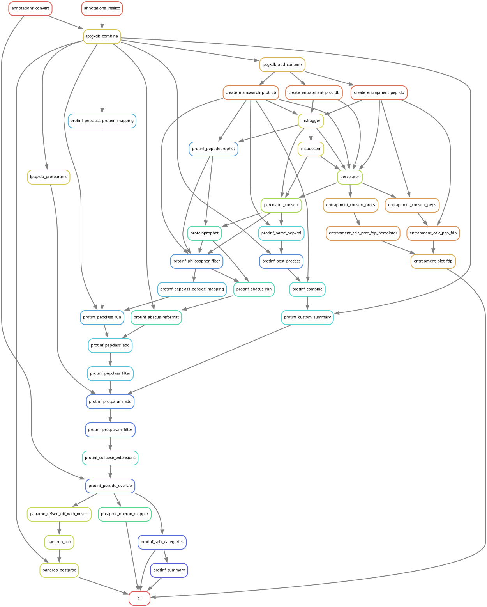

# *M. tuberculosis* proteogenomics Snakemake pipeline
This Snakemake pipeline performs a proteogenomic analysis of six *M. tuberculosis* clinical reference strains from lineages 1 and 2 ([Heiniger et al., 2026](https://doi.org/10.64898/2026.01.27.701740)). The workflow combines genome annotation processing, peptide-spectrum matching, protein inference, and downstream annotation and structural analyses to identify and prioritize candidate small proteins and novel proteins.

The pipeline converts multiple annotation sources to create 2 integrated proteogenomics databases ([iPtgxDBs](https://iptgxdb.expasy.org/)) for each strain: a standard iPtgxDB ([Omasits et al. 2017](https://doi.org/10.1101/gr.218255.116)) and a much smaller custom iPtgxDB based on Rib-seq data ([Hadjeras et al. 2023](https://doi.org/10.1093/femsml/uqad012)), here using orthologs of Ribo-seq identifications from strain H37Rv ([Smith et al. 2022](https://doi.org/10.7554/eLife.73980)). Mass spectrometry data from a Bruker timsTOF Pro device ([PRIDE Project PXD081163](https://www.ebi.ac.uk/pride/archive/projects/PXD081163)) is then searched for each strain against the respective iPtgxDBs using [MSFragger](https://msfragger.nesvilab.org/), relying on [MSBooster](https://doi.org/10.1038/s41467-023-40129-9) and [Percolator](https://github.com/percolator/percolator) for accurate peptide identification. Protein inference and FDR filtering is achieved using [Philosopher](https://philosopher.nesvilab.org/), followed by additional stringent filtering as described ([Heiniger et al., 2026](https://doi.org/10.64898/2026.01.27.701740)).

Pseudogenes with confirmed expression, corrected start sites of annotated genes and completely novel genes are reported separately. Novel gene candidates are further analyzed, including the overlap with pseudogenes and newer annotations, signal peptide and subcellular localization prediction, functional annotation, and integration with Panaroo-based pangenome information.

[TOC]: #
## Table of Contents
- [Software Dependencies](#software-dependencies)
- [Input Data and Configuration](#input-data-and-configuration)
  - [Provided Data to Reproduce Results](#provided-data-to-reproduce-results)
  - [Custom Data](#custom-data)
    - [Custom Strains](#custom-strains)
    - [Custom Annotation Sources](#custom-annotation-sources)
  - [Configuration](#configuration)
- [Running the Analysis](#running-the-analysis)
- [Output](#output)
- [Rulegraph](#rulegraph)
- [Citation](#citation)

## Software Dependencies
By default, most dependencies are installed automatically using conda when running the pipeline for the first time. To disable automatic dependency management, remove `--use-conda` from `run.sh` and make sure the required tools are installed manually.

The workflow relies on a mix of Python-based tools and external software. The main configuration points are defined in `config/config.yaml` and typically require:

|Software|Notes|Link|
|--------|-----|----|
|MSFragger|Peptide search engine|https://github.com/Nesvilab/MSFragger|
|Philosopher|Protein inference and FDR workflows|https://github.com/Nesvilab/philosopher|
|Percolator|Peptide and protein rescoring|https://github.com/percolator/percolator|
|MSBooster|Boosting-based rescoring|https://github.com/Nesvilab/MSBooster|
|InterProScan|Domain and pathway annotation|https://www.ebi.ac.uk/interpro/download|
|HH-suite|Remote homology detection|https://github.com/soedinglab/hh-suite|
|LipoP|Signal peptide prediction|https://services.healthtech.dtu.dk/services/LipoP-1.0|
|PSORTb|Subcellular localization prediction|https://psort.org/downloads/archives.html|
|BLAST|Conservation analysis|https://blast.ncbi.nlm.nih.gov/doc/blast-help/downloadblastdata.html|
|AMP Scanner v2|Antimicrobial peptide prediction|https://github.com/dan-veltri/amp-scanner-v2|

Some of the executables and databases are referenced by absolute paths in `config/config.yaml`; these paths should be adjusted to the local installation before running the workflow.

## Input Data and Configuration
### Provided Data to Reproduce Results
All data required to reproduce the analysis of six *M. tuberculosis* clinical reference strains from lineages 1 and 2 ([Heiniger et al., 2026](https://doi.org/10.64898/2026.01.27.701740)) is provided in the `data` subfolder except for the MS/MS raw data which has to be downloaded separatebly from PRIDE ([Project PXD081163](https://www.ebi.ac.uk/pride/archive/projects/PXD081163)). The downloaded `.d` files have to be moved into the strain specific folders in `data/raw/`. All other input data is provided in the following folders:

- `data/genomes/`: genome sequence files used by the pipeline
- `data/annotations/`: annotation files used as input for the annotation conversion and database creation steps
- `data/contams.fasta`: contaminant protein sequences used during database construction

The default strain set is defined in `config/config.yaml` under `strains` and includes the six analyzed strains: `0052`, `0072`, `0145`, `0153`, `0155`, and `0157`.

### Configuration
Several parameters can be adjusted in `config/config.yaml`, including:

- the configured strains and search settings
- the MSFragger and Percolator/Philosopher executables and options
- the iPtgxDB database setup and enzyme settings
- the post-processing steps for annotation overlap, localization, domain annotation, conservation, and Panaroo integration

## Running the Analysis
Once the input data are prepared and Snakemake is installed, the analysis can be started with:

```sh
./run.sh
```

The pipeline may take a substantial amount of time depending on the number of searches configured and the available CPU resources.

After the workflow finishes, an HTML report can be generated with:

```sh
./create_report.sh
```

## Output
The workflow writes its main results under the `results` directory. The converted annotations and generated iPtgxDBs are stored in the `results/annotations` and `results/iptgxdbs` subfolders, respectively. The search results are organized by search and the 4 stages of the analysis:

- `results/searches/<search>/search/`: search against iPtgxDB assigning and rescoring peptide spectral matches
- `results/searches/<search>/entrapment/`: searches against peptide and protein-level entrapment databases to estimate actual FDR
- `results/searches/<search>/protinf/`: protein inference and filtering
- `results/searches/<search>/postproc/`: downstream annotation and post-processing of novel proteins

The generated HTML report (`report.html`) collects the workflow outputs in a more accessible form.

## Rulegraph
This graph shows the dependencies of the defined Snakemake rules. Arrows indicate that the rule from which the arrow originates produces the files that are used as input by the rule the arrow points to.



## Citation
**Stringent proteogenomic discovery of novel small proteins in Mycobacterium tuberculosis clinical reference strains**

Benjamin Heiniger, Christian Schori, Mohammad Arefian, Amir Banaei-Esfahani, Martin Schuler, Sonia Borrell, Chloé Loiseau, Daniela Brites, Iñaki Comas, Ruedi Aebersold, Sebastien Gagneux, Ben C. Collins, Christian H. Ahrens

bioRxiv 2026.01.27.701740; doi: https://doi.org/10.64898/2026.01.27.701740
